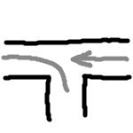
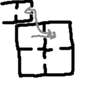
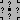
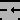

# A Strange Labyrinth
## C++, SFML, and Zenity (Linux only)

# About the Project

A Strange Labyrinth is a small game where you need to navigate an unusual labyrinth. It is generated, so you can customize it, but I recommend starting with the standard labyrinth. Graphics: Pseudo 3D

# How to Install:
On Linux, you will need Zenity (`sudo apt install zenity`)

## 1. You can download the ready-made version from Releases

[link](https://github.com/3NikNikNik3/AStrangeLabyrinth/releases)

## 2. Build it yourself:
You will need `cmake`, `make` (since I rely on cmake, you can try other build systems, but I can't guarantee anything), and `g++` (I don't use its features, so you can use another compiler, but I haven't tested it!)

### Before You Start:
Linux: Install dependencies [from here](https://www.sfml-dev.org/tutorials/3.0/getting-started/cmake/#requirements):

    sudo apt update && sudo apt install \
        libxrandr-dev \
        libxcursor-dev \
        libxi-dev \
        libudev-dev \
        libflac-dev \
        libvorbis-dev \
        libgl1-mesa-dev \
        libegl1-mesa-dev \
        libdrm-dev \
        libgbm-dev

#### Building (start in the project folder):
    cmake -Bbuild -G"Unix Makefiles" -DCMAKE_BUILD_MODE=Release -Dbuild_static=OFF
If you need to build the project with all dependencies included (statically), use `-Dbuild_static=ON`. This may be necessary if, for example, you want to use the built project on another Windows machine.

    cd build
    make
    mv (move) AStrangeLabirinth(.exe) ..
    cd ..

### What to Keep:
All set! Now you can delete everything except `AStrangeLabirinth(.exe)` (the executable file), `images` (pictures, icon, and font), and `data` (where all settings are stored, *optional* (it will be created automatically))

## 3. Open the Project in an IDE:
*Disclaimer: I used Code Blocks, and I can only guarantee it works there, but there shouldn't be any issues with others.*

1. Linux: Install dependencies (see "Build it yourself." "Before You Start")
2. `cmake -Dbuild_static=OFF -B{NAME} -G'{NAME_IDE}'` Instead of `NAME`, specify the folder where the IDE files will be located, for example *CB*, and instead of `NAME_IDE`, specify the name of the desired IDE (check in `cmake --help`)
3. In {NAME}, you will find the files for the IDE

# Controls:
I tried to make it convenient to control with both the mouse and keyboard:

## In the Menu:
### Mouse:
cursor...

### Keyboard:

`TAB` - next element

`Enter` - press the button (sometimes switches to another element for convenience)

`Arrow keys` - increase/decrease

## In the Game:
### Mouse (can be disabled):
`Move left and right` - rotate

`Right Click` and `Left Click` - move

### Keyboard:
`WASD` - movement

`QE` - camera rotation

`Shift` - speed up (must be held down)

`ESC` - pause

## You can exit anywhere by pressing ALT+F4

# Besides the labyrinth itself, there are a couple of additional features (around it):
- Save, edit, and load labyrinth generator settings
- Save and load the labyrinth itself (it will match exactly). This is not a save of the process; after loading, you will start from the beginning!
- Settings (graphics and mouse usage):

## More About Graphics Settings

 - number of pixels in a column before SFML scaling

 - SFML scaling (was 1 pixel, now this)

 - mouse sensitivity

 - whether to use the mouse in the game

 - maximum fps (if 0, there is no limit)

 - whether to display fps

# *Attention*: Before reading further, I recommend navigating the labyrinth yourself to understand its strangeness!!!

## What Makes It Unusual
## General:
I wanted to break the rule `left + right = right + left`, to create a labyrinth that cannot be represented on a map (classical). And I did it: the entire labyrinth is divided into rooms, and each exit from a room leads to a separate room (to better understand, I recommend settings 4-0-4-1).

https://github.com/user-attachments/assets/9cc43a0d-f165-4ce4-909c-dc2c4675ba12

As a result, rooms can "overlap," and to navigate, you need to think a little longer.

## About Dead Ends:
Each dead end can also be unusual (for "confusion" and to showcase its strangeness); the probability is relative and can be set in the generator settings.

There are 3 types of unusual dead ends:

1. Infinite Corridor:
An infinite corridor stretches left and right with many exits. In reality, it is the same corridor. Here is its diagram:

2. Infinite Turn:
Once you enter it, you will keep turning right indefinitely, and if you decide to return, you will end up much further away. This is simply a looping turn where one exit (portal) is connected to the entrance (the former dead end). The connection point depends on the direction of the dead end, but if the entrance to the dead end is to the left, here is the diagram:

3. False Exit:
You will see what seems to be a normal exit, but when you approach it, it will disappear. It's just a wall with a color that depends on the distance. In the "default" labyrinth, this is turned off so that a player better understands what an exit is.

# How It Works Programmatically:
## How to Store the Labyrinth:
Each room stores a list of pointers to neighbors; if it is `nullptr`, there is no neighbor (`*Tile[4]`). This is how all the unusualness is created!

## Walls:
Walls are generated based on the presence of neighbors and the fact that the current tile is not an end (it does not generate a portal).

There are 4 types of walls:
1. Portals (0-3) - needed exclusively for teleporting rays.
2. Regular walls (4) - you cannot pass through them... gray...
3. Exit (5) - a wall with a different color (yes, the game ends when you enter a room with an exit, not at the exit itself).
4. False Exit (6) - a regular wall, but it has the color of an exit, and when you get close, it turns into a regular one.

## Transition Between Rooms:
Player teleportation occurs when crossing boundaries (<0 or >4 on x or y); portal walls are only needed for teleporting rays (to see through them).

## Generation:
1. From the starting point, rooms are generated (the number is adjustable).
2. Depending on the depth (adjustable), we choose 50/50 how many exits there will be (3/2, 2/1, 1/0, 0). This is done recursively for each room. Dead ends are saved separately.
3. We choose 1 dead end that will become an exit (the probabilities are equal), and then for each remaining dead end, we choose its unusualness (including regularity).

# Generator Settings

 - number of exits from the starting room

, , and  - depth during which the choice will be made 3/2, 2/1, 1/0.

## A Small Disclaimer

Do not set large values for the above settings!

While it is possible to set them up to 255, it will require a lot of memory and time for calculation.

With settings of 4-10-10-10, a maximum of `725564587` rooms can be generated. That’s `~28 GiB`! And this is without accounting for memory costs for rendering.

## Settings for Unusual Dead Ends

The probability of each type = `set number` / `sum of all numbers`.

 - regular dead end

 - infinite corridor

 - infinite turn

 - false exit

# A Few Interesting Facts:
- The exit color was chosen unintentionally, but I left it that way.
- The engine allows for any walls with integer coordinates for the ends in rooms, but to maintain the feeling of corridors
- If you somehow get outside the walls, you can bypass the labyrinth from the side, but the rendering will be broken. By the way, let me know how you did it; that's a bug!

# [ReadMe on Rus](https://github.com/3NikNikNik3/AStrangeLabyrinth/blob/main/ReadMe_ru.md)
