# A strange labyrinth
## C++, SFML и zenity (только на Linux)

# О проекте

A strange labyrinth - это небольшая игра, где нужно пройти необычный лабиринт. Он генерируется, так что можно его настраивать, но я рекомендую сначала пройти стандартный лабиринт. Графика: Псевдо 3D

# Как установить:
В Linux Вам понадобиться zenity (`sudo apt install zenity`)

## 1. Можно скачать готовую версию в Releases

[ссылка](https://github.com/3NikNikNik3/AStrangeLabyrinth/releases)

## 2. Собрать самому:
Вам понадобиться `cmake`, `make` (т.к. я опираюсь на cmake, то можете попробовать другие системы сборки, но гарантировать я ничего не могу), `g++` (я не использую его фишки, так что можно другим воспользоваться, но я не проверял!)

### Перед началом:
Linux: Установите зависимости [отсюда](https://www.sfml-dev.org/tutorials/3.0/getting-started/cmake/#requirements):

    sudo apt update && sudo apt install \
        libxrandr-dev \
        libxcursor-dev \
        libxi-dev \
        libudev-dev \
        libflac-dev \
        libvorbis-dev \
        libgl1-mesa-dev \
        libegl1-mesa-dev \
        libdrm-dev \
        libgbm-dev

#### Сборка (начинать в папке с проектом):
    cmake -Bbuild -G'Unix Make Files' -DCMAKE_BUILD_MODE=Release -Dbuild_static=OFF
Если Вам нужно собрать проект со всеми зависимостями внутри (статически), то в `-Dbuild_static`, установите `ON`, это может понадобиться, если, например, Вы хотите использовать собранный проект на другой Windows

    cd build
    make
    mv (move) AStrangeLabirinth(.exe) ..
    cd ..

### Что оставить:
Всё готово, теперь можете удалить всё, кроме `AStrangeLabirinth(.exe)` (исполняемый файл), `images` (картинки, иконка и шрифт) и `data` (там хранятся все настройки, *опционально* (сама создаться))

## 3. Открыть проект в IDE:
*Дисклеймер: я использовал Code Blocks, и могу гарантировать работу только в ней, но с остальными не должно возникнуть проблем*

1. Linux: Установите зависимости (см. "Собрать самому"."Перед началом")
2. `cmake -Dbuild_static=OFF -B{NAME} -G'{NAME_IDE}'` Вместо `NANE` - папка, где будут находиться файлы для IDE, например *CB*, а вместо `NAME_IDE` - имя нужного IDE (посмотреть в `cmake -help`)
3. В {NAME} находятся файлы для IDE

# Управление:
Я старался сделать так, чтобы было удобно управлять и мышкой, и клавиатурой:

## В меню:
### Мышкой:
курсор...

### Клавиатура:

`TAB` - следидущий элемент

`Enter` - нажать на кнопку (иногда переключается на другой элемент для удобства)

`Стрелочки` - Сделать больше/меньше

## В игре:
### Мышка (можно отключить):
`Сдвиг в право и лево` - поворот

`ПКМ` и `ЛКМ` - двигаться

### Клавиатура:
`WASD` - перемещение

`QE` - поворот камеры

`Shift` - ускориться (нужно зажать)

`ESC` - пауза

## Везде можно выйти, нажав ALT+F4

# Помимо самого лабиринта есть ещё пару функций (вокруг него):
- Сохранить, редактировать, загружать настройки генератора лабиринта
- Сохранить, загрузить сам лабиринт (он будет полностью совпадать). Это не сохранение процесса, после загрузки Вы начнёте с начала!
- Настройки (графики и использование мыши):

## Подробней о настройках графики

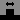 - количество пикселей в столбике до SFML-масштабирования

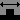 - SFML-масштабирование (был 1 пиксель стал такой)

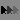 - чувствительность мыши

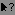 - использовать ли мышь в игре

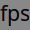 - максимум fps (если 0, то ограничения нет)

# *Внимание*: прежде чем читать далее я рекомендую пройти лабиринт самому и понять в чём его странность!!!

# В чём его необычность
## Общее:
Я хотел нарушить правило `лево + право = право + лево`, сделать лабиринт, который невозможно изобразить на карте (классической). И я это сделал: весь лабиринт поделён на комнаты, и каждый выход из комнаты ведёт в отдельную комнату (чтобы лучше понять, рекомендую настройки 4-0-4-1)

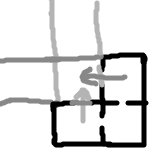

В итоге комнаты могут "пересекаться", а для ориентирования нужно подумать немного дольше

## Про тупики:
В том числе каждый тупик может стать необычным (для "запутывания" и показа необычности), вероятность относительна, можно задать в настройках генератора

Есть 3 типа необычных тупиков:

1. Бесконечный коридор:
В право и в лево простирается бесконечный коридор с кучей выходов. На самом деле это один и тот же коридор. Вот его схема:

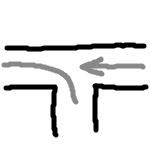

2. Бесконечный поворот:
Зайдя в него, Вы будете бесконечно поворачивать направо, а если решите вернуться, то прйдёте намного меньше. Это просто зацикленный поворот, где один выход (портал) присоединён с входом (бывший тупик). Точка присоединения зависит от направления тупика, но если вход в тупик влево, то вот схема

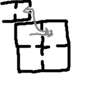

3. Ложный выход:
Вы увидите, вроде, нормальный выход, но когда подойдёте, он исчезнет. Просто стена с цветом, зависящим от расстояния. В лабиринте "по умолчанию" выключена, чтобы игрок лучше понял, что такое выход

# Как устроенно программно:
## Как хранить лабиринт:
Каждая комната хранит список указателей на соседей, если это `nullptr`, то соседа нет (`*Tile[4]`). И так просто создаётся вся необычность!

## Стены:
Стены генерируются в зависимости от присутствия соседей и факта, не является ли текущий тайл концом (не генерирует портал).

Есть 4 типа стен:
1. Порталы (0-3) - нужны исключительно для телепортации лучей
2. Обычные стены (4)... Через неё нельзя пройти... Серенькая...
3. Выход (5) - стена с другим цветом (да, игра оканчивается, когда Вы входите в комнату с выходом, а не в выход)
4. Ложный выход (6) - обычная стена, но имеет цвет выхода, при приближении превращается в обычную 

## Переход между комнатами
Телепортация игрока происходит при пересечении границ (<0 или >4 по x или y), портальные стены нужны лишь для телепортации лучей (чтобы видеть через них)

## Генерация:
1. Из начальной выходят комнаты (количество настраивается)
2. В зависимости от глубины (настраивается) выбираем 50/50 сколько будет выходов (3/2, 2/1, 1/0, 0). Для каждой комнаты рекурсивно. Отдельно сохраняем тупики
3. Выбираем 1 тупик, который станет выходом (вероятности равны), а после для каждого оставшегося тупика выбираем необычность (включая обычность)

# Настройки генератора

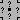 - количество выходов из начальной комнаты

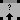, 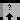 и 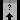 - глубина, на протяжении которой будет делаться выбор 3/2, 2/1, 1/0

## Небольшой дисклеймер

Не устанавливайте вышеуказанным настройкам большие значения!

Хоть и можно установить до 255, но потребуется много памяти и времени для расчёта

При выставлении 4-10-10-10, максимально будет сгенерировано: `725564587` комнат. А это `~28 ГиБ`! И это без учёта затрат памяти на отрисовку

## Настройки необычных тупиков

Вероятность каждого типа = `установленное число` / `сумма всех чисел`

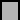 - обычный тупик

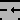 - бесконечный коридор

 - бесконечный поворот

 - ложный выход

# Пара интересных фактов:
- Цвет выхода был выбран непреднамеренно, но я его таким оставил
- Движок позволяет в комнатах делать любые стены с целочисленными координатами концов, но чтобы оставить ощущение коридоров, я использую ровные стены (возможно добавлю другое отображение)
- Всё происходит в пещере
- Если Вы как-то выберетесь за стены, то сможете обойти лабиринт сбоку, но отображение будет поломано. Кстати, напишите мне, как Вы это сделали, это баг!
